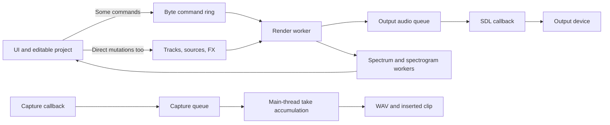
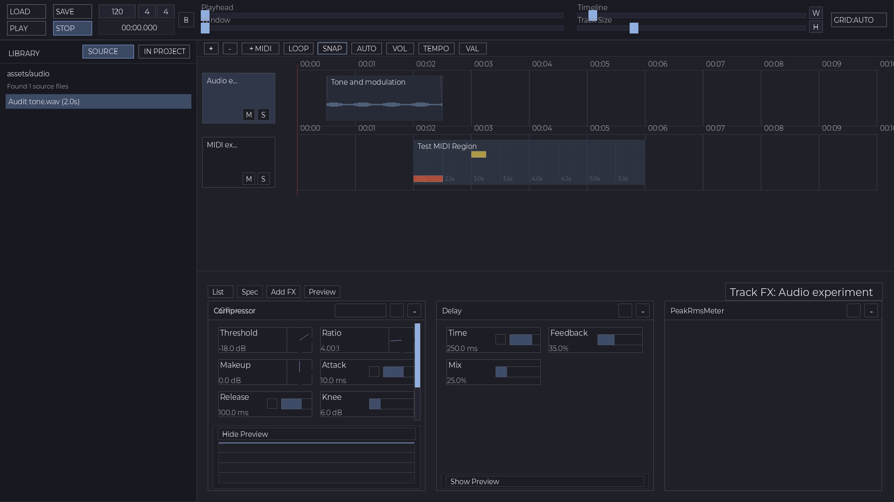

# soniCs runtime, audio engine, and UI audit — 2026-09-19

**Assessment:** soniCs is a substantial custom DAW alpha, with much more functionality than its “minimal prototype” language suggests. It is a promising sound-editing and sound-exploration foundation. Its next milestone should be reliable editing during playback and trustworthy audio measurements. More effects, a generic node editor, and visual polish should follow that milestone.

This audit covers checkout `d8bff97` (`Release daw 0.3.0`). `VERSION` is `0.3.0`; README and `docs/current_truth.md` still say `0.2.0`. This is a source/build audit, not verification of a published release or installed application. No production implementation was changed and no commit was made.

**1. Scope and evidence**

Inspected the device callback, render worker, transport/command queues, graph, track/clip lifecycle, FX manager and representative DSP implementations, samplers/instruments, analysis workers, recording, bounce, persistence, main loop, layout, and related tests. Ran existing stable and legacy suites, the application build, and five targeted offline defect probes. Captured and inspected two actual Vulkan-rendered frames using a separate temporary runtime directory and dummy audio: empty project and generated audio/MIDI/effects project.

Evidence labels below:

- **Reproduced:** a small executable exercised current code and demonstrated the result.
- **Source-confirmed:** the implementation establishes the defect or missing contract; its frequency or audible impact was not measured on hardware.
- **Recommendation:** an architectural or product choice, not a claim that a test failed.

No physical microphone/speaker loopback, listening comparison, sustained high-track-count benchmark, sanitizer race campaign, or exhaustive mathematical validation of every effect was performed. First-frame captures do not prove gesture quality or playback smoothness. The initial sandboxed visual attempt could not access displays/CoreAudio; the successful isolated captures used display access and dummy audio. This environment failure is not classified as a DAW audio defect.

**2. What is already built**

| Area | Existing capability | Assessment |
| --- | --- | --- |
| Arrangement | Multi-track audio/MIDI regions, move/trim/split/selection, snapping, zoom, loop, undo | A usable domain model worth preserving |
| MIDI | Piano roll, QWERTY audition/recording, velocity, quantize, clipboard, grouped built-in presets, per-region/track instrument parameters | Considerably beyond a basic audio player; external MIDI remains absent |
| Processing | Track/master FX chains, separate EQ, pan, automation, many built-in effect families | Breadth exceeds current numerical and concurrency validation |
| Analysis | Peak/RMS, LUFS implementation, correlation, mid/side, vectorscope, spectrum and spectrogram | Useful foundation, but analyzer input and calibration need repair |
| Recording | SDL capture, selected-track placement, waveform preview, undoable clips, persistence | Functional short-take workflow; not yet a dependable overdubbing architecture |
| Persistence | Versioned session documents, project restore, media registry, explicit data roots | Useful contracts; save durability and snapshot consistency need work |
| Presentation | SDL shell with Vulkan rendering, theme/font adapters, waveform caches, fixed pane layout, workspace presentation profiles | Existing foundations can support cohesive redesign |
| Runtime infrastructure | Wake-blocked UI loop, invalidation, jobs/messages, background analysis | Preserve it; audio-worker ownership is a separate unresolved layer |

Sources: [README](../../../README.md), [engine API](../../../include/engine/engine.h), [automation targets](../../../include/engine/automation.h), [FX registry](../../../src/effects/effects_builtin.c), [loop adapters](../../../src/core/loop/README.md).

**3. Current execution model**

The SDL output callback does very little: it reads float frames from an output queue and fills shortages with silence. That separation is a good starting point. The render worker performs the actual audio computation ahead of the device. A lightweight callback alone does not guarantee glitch-free audio: the producer still needs a bounded execution budget and safe ownership.



Actual mix order is clip source plus clip/track gain → track FX → separate track EQ → track spectrum tap → track balance/pan → track meter → master sum → separate master EQ → master FX → sanitization → master meter. Master spectrum is captured afterward. In particular, the track spectrum and meter do not observe the same processing point. Track gain is before inserts, so it changes how hard dynamics/distortion are driven; it is not a conventional final channel fader.

Sources: [engine_audio.c](../../../src/engine/engine_audio.c), [engine_core.c](../../../src/engine/engine_core.c), [graph.c](../../../src/engine/graph.c).

**4. Priority 1: ownership, transport, and basic audio correctness**

**F1 — Live edits can invalidate objects being rendered. Source-confirmed; highest priority.**

`engine_remove_clip()` destroys the sampler/instrument and releases media immediately, then queues a graph rebuild. The current graph retains those source pointers until the worker handles that command. The UI deletion paths call this API without stopping the worker. Track growth can reallocate `engine->tracks` while mixing uses it. FX add/remove/reorder hold `fxm_mutex`, but the render functions do not acquire that mutex; locking only the writer does not protect readers. FX snapshots also race with worker parameter updates. Meter double buffering publishes an index without preventing the producer from reusing the reader's buffer two blocks later. `transport_frame` is a plain integer written by the worker and read elsewhere.

Consequences include possible use-after-free, inconsistent parameter/state reads, and intermittent playback failures. A particular crash was not reproduced, but the ownership violations are visible in the call paths.

Repair with explicit audio-worker ownership and coherent snapshots: prepare replacement state off the render path, publish at block boundaries, acknowledge revisions, and reclaim retired objects only after the worker releases them. Small scalar changes should be queued/coalesced. Define one authoritative producer for each queue. Do not solve this by putting a large project mutex around all rendering.

Sources: [clip deletion and destruction](../../../src/engine/engine_clips.c), [track allocation](../../../src/engine/engine_tracks.c), [FX UI APIs](../../../src/engine/engine_fx.c), [unlocked FX rendering](../../../src/effects/effects_manager.c), [meter snapshots](../../../src/engine/engine_meter.c), [transport getter](../../../src/engine/engine_transport.c).

**F2 — A full command queue accepts partial commands. Reproduced.**

`engine_post_command()` calls a byte-stream write and checks its returned length afterward. The ring truncates writes to free space, so reporting failure does not undo the partial write. In this build a command is 96 bytes and the rounded queue capacity is 8192 bytes. After 85 complete commands, a rejected command still deposits 32 bytes. With a deterministic producer/consumer interleaving, a subsequently accepted seek to frame 98765 is lost; transport remains at 12345.

Use fixed-size message slots or an all-or-nothing packet API, explicit overflow accounting, and bounded handling for essential stop/note-off commands. Coalesce replaceable parameter changes. Test saturation, wrapping, recovery, ordering, and lifetime of payloads.

Sources: [engine_core_commands.c](../../../src/engine/engine_core_commands.c), [ringbuf.c](../../../src/audio/ringbuf.c), [probe](runtime_probe.c).

**F3 — Queue resets violate concurrent ring ownership. Source-confirmed.**

Stop/seek reset both audio-ring indices while the SDL callback can be reading. Paused recording clears the capture ring while its callback can write. Analysis producers discard old data by calling the consumer read API, competing with the analysis worker; both sides also reset queues. Atomics on individual indices do not make these compound operations safe.

Use consumer-owned flushing, stream generations, or an explicitly quiescent reset handshake. For analysis, dropping a new packet with a discontinuity marker is preferable to having two consumers manipulate one SPSC tail.

Sources: [command processing](../../../src/engine/engine_core_commands.c), [record drain](../../../src/app/audio_recording.c), [spectrum queue](../../../src/engine/engine_spectrum.c), [spectrogram queue](../../../src/engine/engine_spectrogram.c).

**F4 — Output format negotiation permits an incompatible callback format. Source-confirmed.**

Output opens with `SDL_AUDIO_ALLOW_ANY_CHANGE`; if the device returns something other than float32 it only logs a warning. The trampoline still casts the output memory to floats and computes frame counts as float32. This is incorrect on a non-float negotiated format. Capture already handles this more defensibly by disallowing format changes and rejecting an unsupported result.

Require float32 at the engine boundary, or convert explicitly in a device adapter. Add fake-backend output tests for rejected formats and changed channel/rate/block counts. Also establish an explicit mono/stereo contract rather than implicitly accepting arbitrary channels.

Sources: [device_sdl.c](../../../src/audio/device_sdl.c), [capture counterpart](../../../src/audio/audio_capture_device_sdl.c).

**F5 — Zero gain becomes unity gain. Reproduced.**

Graph rebuilding treats both zero track gain and zero clip gain as “use 1.0.” A constant 0.25 fixture produces 0.25 at normal gain, zero track gain, and zero clip gain. Session restoration also replaces explicit zero gains with 1.0. Zero must be a valid silence value; missing fields should receive defaults only during parsing/migration. This repair is small, but it must cover rendering, audition, and save/reload together.

Sources: [source gain assembly](../../../src/engine/engine_core_commands.c), [audition mix](../../../src/engine/engine_audio.c), [session application](../../../src/session/session_apply.c).

**F6 — Render position is used as if it were audible position. Source-confirmed; latency estimate, not hardware measurement.**

The worker fills available queue space rather than maintaining a small target occupancy. Capacity is `block_size * 32`: at 128 frames and 48 kHz, 4096 frames represent 85.33 ms, before device buffering. The worker advances `transport_frame` while generating those future samples. UI playhead and recording placement read that position. Larger negotiated blocks increase the possible lead. Simply lowering the advertised block size does not fix this contract.

Introduce separate rendered, device-consumed, and presentation positions, plus timestamped capture. Use target queue watermarks and a measured low-latency mode. Count underruns, queue depth, command age, and worst-case render time; existing average timing logs are insufficient. A 128-frame block at 48 kHz gives a 2.67 ms deadline. Define a measured safety margin under editing/analysis load.

Sources: [worker and queue capacity](../../../src/engine/engine_core.c), [callback](../../../src/engine/engine_audio.c), [transport](../../../src/engine/engine_transport.c), [record start](../../../src/app/audio_recording.c).

**5. Priority 2: trustworthy DSP and measurements**

**F7 — Frequency analysis concatenates separated pieces of audio. Reproduced for spectrum; same pattern in spectrogram.**

Both input paths capture every fourth block. Their workers concatenate captured blocks into windows and analyze the result at the original sample rate. A ramp probe produces source indices `384..511`, then `896..1023` as adjacent samples. That is neither a contiguous window nor properly filtered downsampling. It introduces discontinuities and can produce misleading frequency content.

Feed contiguous windows; reduce transform/display update frequency instead of dropping pieces of a window. Use explicit window length, hop size, sample rate, timestamp, channel mode, and discontinuity information. Current “FFT” paths actually compute trigonometric sums at log-spaced frequencies, repeatedly evaluating window and phase functions. Correct the input first, then benchmark an efficient transform or precomputed analysis kernel.

Spectrum also applies A-weighting and uses `(L+R)/2`; spectrogram lacks that weighting. Out-of-phase stereo can disappear in the mono sum. Hann-window magnitude is divided by N without a coherent-gain/one-sided amplitude correction. These displays should expose flat versus weighted analysis and L/R/mid/side modes, with calibration against known tones and noise. Do not label them interchangeable raw dBFS views.

Sources: [spectrum](../../../src/engine/engine_spectrum.c), [spectrogram](../../../src/engine/engine_spectrogram.c).

**F8 — Fade curve drawings do not match audio. Reproduced.**

The clip stores linear/S/log/exponential choices and the UI evaluates those shapes. The sampler receives only fade durations and always applies linear ramps. With a 0.25 constant source and a 128-frame fade, both linear and exponential give 0.0625 at one-quarter progress. The UI's exponential formula implies approximately 0.0118415 instead.

Move fade evaluation into a UI-free audio/domain helper and use the same definition in DSP, preview, and export. Cover every curve, endpoints, overlapping fades, trim, split, and round-trip state.

Sources: [curve setter](../../../src/engine/engine_clips.c), [sampler](../../../src/engine/sampler.c), [UI curve math](../../../include/ui/render_utils.h).

**F9 — Limiter lookahead does not do what its control says. Reproduced.**

The limiter reads `(write_pos + look_samples - 1) % look_samples`, which yields the previous sample, not the configured oldest delayed sample. A 5 ms/48 kHz impulse test produces the impulse at frame 1, rather than approximately frame 240. Its descriptor reports zero latency and the engine has no latency-compensation consumption path. Changing lookahead allocates/reset buffers through the parameter setter, which can execute on the render worker.

Repair detector/delay semantics, preallocate supported delay capacity, publish actual latency, and test impulse delay, ceiling, release, block-size independence, stereo linking, and parameter transitions. Add latency compensation before parallel routing becomes important. This is not a verified true-peak limiter.

Source: [fx_limiter.c](../../../src/effects/dynamics/fx_limiter.c).

**F10 — Export is not a transparent, isolated rendering operation. Source-confirmed.**

Bounce stops the live engine, renders through its existing state, allocates the entire output in RAM, and automatically scales down peaks above 1.0. Graph reset only resets source objects; it does not comprehensively reset FX/EQ history. Default bounce ends at the last region boundary, without an explicit effect-tail extension. Output also creates PCM16 and float files, ignoring the float-file success result. A bounce is automatically inserted as another track; if originals remain audible, subsequent playback includes both unless the user intervenes.

Use a project/render snapshot and fresh deterministic DSP state for export, with explicit pre-roll, tail, sample rate, format, normalization, and insertion options. Stream blocks to a file. Test repeated exports and real-time/offline parity, including seek and preceding-playback history. Exact PCM16 byte equality requires a fixed dither seed.

Sources: [engine_io.c](../../../src/engine/engine_io.c), [main_bounce.c](../../../src/app/main_bounce.c), [bounce insertion](../../../src/app/bounce_region.c).

**F11 — Media conversion is narrow and inexpensive rather than production-quality. Source-confirmed.**

WAV import accepts PCM16 or 32-bit float, not common PCM24 or extensible WAV cases. WAV sample-rate conversion uses linear interpolation without an explicit anti-alias filter. FFmpeg MP3 fallback first decodes to PCM16. Media is fully decoded into memory. At 48 kHz stereo float, an hour of one source is about 1.38 GB before cache/working overhead.

Prefer an explicit supported-format contract and a tested band-limited conversion path. Keep media/project rate independent of output-device rate. Currently clips can be loaded at the configured rate before `engine_start()` replaces the engine rate with the negotiated device rate; sampler reset ignores its rate argument. A device-rate mismatch therefore needs a targeted correctness test for pitch, duration, EQ, and timeline timing.

Sources: [media_clip.c](../../../src/audio/media_clip.c), [media_cache.c](../../../src/audio/media_cache.c), [sampler reset](../../../src/engine/sampler.c), [engine_start](../../../src/engine/engine_core.c).

**Further DSP quality work:** block-level FX parameter smoothing already exists, but per-sample ramps are still appropriate for gain and other click-sensitive controls. Built-in saw/pulse and nonlinear instrument paths have no evident band-limiting/oversampling; measure their aliasing before deciding which instruments need higher-quality modes. Live note-off removes audition notes immediately rather than maintaining release voices, and stopped rendering ceases with no active notes; define release/tail behavior. Gain-reduction preview is derived from input/output RMS ratio, so makeup gain and timing can affect it; true detector reduction should come from the processor. The sidechain compressor exposes a sidechain API, but the manager calls ordinary `process`, with no connected external sidechain routing. Automation supports volume/pan/instrument targets, not arbitrary FX-parameter lanes.

Sources: [instrument_osc.c](../../../src/engine/instrument_osc.c), [audition](../../../src/engine/engine_midi_audition.c), [effects manager](../../../src/effects/effects_manager.c), [automation vocabulary](../../../include/engine/automation.h).

**6. Priority 1–2: saving and recording you can trust**

**F12 — Session saving truncates the destination before the replacement is complete. Source-confirmed; data-loss risk.**

`session_document_write_file()` opens the actual destination with `wb`. It checks write/close errors, but failure can already have destroyed the previous good file. Application shutdown automatically saves a named project. The media registry and last-project marker also use direct writes.

Write a validated complete temporary file in the destination directory, flush/check it, replace atomically, and retain a recovery copy according to a clear policy. Define project-wide ordering for media creation and session publication. Save from a coherent engine/document snapshot. Fault-injection tests should prove that disk-full/interrupted saves leave the last good project readable. Round-trip serialization tests alone do not prove this.

Sources: [session_io_write.c](../../../src/session/session_io_write.c), [project_manager.c](../../../src/session/project_manager.c), [media_registry.c](../../../src/audio/media_registry.c), [shutdown save](../../../src/app/main.c).

**Recording limitations:** capture starts independently, UI updates decide whether to drain or discard it, and a take is accumulated in a growing RAM buffer. There are dropped-frame counters, which is useful, but missing frames are omitted from the take rather than represented with a timestamped discontinuity. Capture/playback device clocks and round-trip latency are not reconciled. Recording is finalized as dithered PCM16. Seek, loop, pause/resume, and long-take behavior need explicit semantics and tests.

Next recording slice: timestamped capture packets, safe gate transitions, background disk writer, recoverable temporary takes, float/24-bit format policy, durable record arm, device/channel selection, input meters, and explicit monitoring. Verify alignment with a real loopback impulse. Keep hardware proof separate from the existing fake-backend tests.

**7. Runtime efficiency and maintainability**

Fix correctness first, then measure. High-value targets identified in source:

- Every track render scans the global source list, and every attached sampler loops over the block even outside its clip interval. Compile per-track active-source ranges and skip non-overlapping regions before per-sample work.
- Graph rebuilds reset all sources and can copy/allocate MIDI and automation state. Pan/gain changes request whole rebuilds. Use targeted parameter commands and incremental graph preparation.
- The sampler locks its automation mutex during rendering. Limiter parameter changes can allocate. Worker transport/meter notifications call the main-thread message layer, whose accepted posts allocate memory and use mutex queues/wake machinery. Decouple render telemetry into fixed storage that a noncritical publisher drains.
- Double-buffered meters need actual reader lifetime protection, not only an atomic active index. Meter decay should be based on elapsed audio time rather than fixed per-block decay.
- Audio, spectrum, and spectrogram workers use millisecond polling sleeps. Improve scheduling after measuring queue occupancy and CPU load; avoid replacing the dedicated render worker with a general background pool.
- Recording and bounce grow with total duration; media decoding and library work can block the UI. Add bounded streaming/background work where measurement shows the need.
- `make/flags.mk` sets warnings and C11 but no optimization level for ordinary app C compilation. Benchmark an explicitly defined optimized profile before judging runtime capacity. Shared libraries have different local build flags.
- Several files are still around 800–1000 lines, but splitting them is secondary to enforcing ownership. The outer lifecycle wrapper sets stage flags while the real lifecycle remains in `main.c`; do not mistake structural decomposition for runtime isolation.
- Shutdown currently tears down main-thread messaging before destroying/stopping the engine. Stop producers before freeing their notification infrastructure.

Retain the existing wake/invalidation design and waveform/texture caches. They are positive work already completed. No performance numbers beyond the queue-size calculation were measured in this audit.

**8. UI: improve functional structure, then physical expression**



The screenshot is an actual source render of an isolated synthetic project, not a proposed mockup. It shows the reusable arrangement/library/detail structure. It also shows a dense, visually uniform transport; long sliders competing with primary actions; abbreviated track names; repeated track rulers; narrow parameter controls inside large effect cards; and low-contrast knobs. “GR” overlaps the compressor header in this captured state. Labels such as `B`, `W`, `H`, `AUTO`, `VOL`, and `VAL` require prior knowledge. Record arm/device state is not prominent in the shell.

One captured size does not establish behavior at every window size or font scale. The layout sweep tests pass; screenshot inspection demonstrates why numerical geometry gates need visual counterparts.

Recommended cohesive UI workstreams, after backend contracts are reliable:

1. **Transport and audio status.** Group play/stop/record/loop; distinguish time from bars/beats; show selected device, sample rate, buffer/latency, underruns, input level, and recording target. Group zoom/navigation separately from transport.
2. **Track headers and mixer.** Persistent track identity/color, meaningful names, arm/monitor/mute/solo, trim versus output fader, pan/balance, and meters. Make the signal order visible. Hard audio/MIDI typing is a product choice; explicit capabilities and routing matter more than imposing type restrictions immediately.
3. **Arrangement editing.** One clear shared time ruler, predictable snap/grid/zoom, explicit selection and hover, visible trim/fade handles, and feedback that makes destructive versus nondestructive actions clear. Keep waveform envelopes at overview scale and actual samples at close scale.
4. **Clip inspector.** Connect source offset, arrangement position, duration, gain, and fade shape to the same visible selection. Preview must use the same math as playback. Provide numeric entry and reversible gestures.
5. **Effects workspace.** A legible ordered signal chain, stable bypass/delete controls, consistent units, logarithmic frequency controls, fine adjustment/reset/numeric entry, and focused expanded editors. Label schematic previews separately from measured audio. Offer pre/post measurement and loudness-matched bypass for meaningful comparison.
6. **Analysis workspace.** Synchronized waveform/spectrum/spectrogram/phase views with cursor readout, shared selected interval, freeze/compare, source/tap labels, window size, resolution, and time/frequency tradeoff controls. Begin with a flat calibrated spectrum, then expose perceptual weighting intentionally.
7. **Recording and MIDI workspace.** Visible input/arm/monitor flow and take status; then clear piano-roll tools, velocity/envelope behavior, and instrument controls. External MIDI can follow timestamping and voice-lifecycle work.

A more physical feeling should come from stable spatial relationships and truthful responses: tracks carry sound, inserts transform it in order, meters observe named points, and gestures alter visible quantities. Depth, color, and animation should reinforce those relationships. A general 3D scene or freeform node system is not required to achieve this.

**9. Architecture direction and shared-library reuse**

Preserve five explicit owners: editable project/document, prepared render plan, audio-worker runtime state, timestamped analysis snapshots, and UI view state. Audio data should flow through stable handles/revisions rather than UI-owned pointers. Device rate/channel conversion belongs at an explicit boundary; project timing must remain stable across device changes. Plan separate input trim, inserts, fader/pan, sends/buses, and master stages before adding routing, but implement buses only after ownership and latency contracts are ready.

Applied `shared-core-governance` and checked the catalog, ownership/versioning/workflow/adoption documents plus the vendored queue contract. The DAW's dependency source remains `third_party/codework_shared`; current sibling documentation is design guidance, not evidence that a newer shared API is available in this checkout.

- **Reuse adopted:** existing `core_time`, main-loop `core_wake/core_sched/core_jobs/core_kernel`, theme/font/pane/workspace adapters, `kit_viz`, and `kit_render` should remain the foundation for their present responsibilities. `core_workers` is a candidate for noncritical decode/export preparation using the established integration pattern.
- **Reuse deferred for real-time transfer:** current `core_queue` provides an unsynchronized pointer ring or a mutex queue, not a ready-made wait-free audio transport. Do not swap it into the callback to satisfy a reuse goal. Define the necessary SPSC/packet/lifetime contract first; evaluate a compatible shared extension only if cross-app demand justifies it.
- **Reuse deferred for a generic audio core:** keep musical time, routing policy, recording placement, voice state, and DSP semantics DAW-owned for now. `core_math`, `core_data`, `core_pack`, and `core_trace` can support numerics/artifacts/diagnostics where their existing contracts fit; `core_scene/core_space/core_memdb` do not solve the immediate audio problems.

No shared APIs, versions, or adoption metadata changed in this audit.

**10. Numbered implementation sequence**

| Stage | Deliverable | Completion evidence |
| --- | --- | --- |
| S1 | Engine ownership and queue repair; format boundary; zero-gain fix | Queue saturation/wrap tests, fake output-device negotiation tests, gain/save/reload tests, delete/add/reorder stress during rendering, sanitizer-supported lifetime/race coverage |
| S2 | Durable saves plus honest transport/capture timing | Failed-save recovery, consumed/rendered clock tests across seek/loop, occupancy/underrun/deadline telemetry, measured loopback alignment |
| S3 | Truthful DSP and analysis | Shared fade math; limiter impulse/ceiling tests; continuous calibrated analysis; sample-rate conversion tests; deterministic bounce/reset/tail/parity tests |
| S4 | Sustained workload and recording scalability | Optimized-build benchmarks across tracks/regions/FX, bounded memory, disk-streamed takes/bounces, long-recording recovery, bounded background tasks |
| S5 | Cohesive UI slices | Transport → tracks/mixer → arrangement/inspector → effects/analysis → recording/MIDI; screenshot and interaction checks per slice |
| S6 | New creative capability | Buses/sends, real sidechains, FX automation, external MIDI, richer instruments/modulation after prerequisites pass |

S1 should start with small independently reviewable repairs and a written ownership invariant. S2 save durability can proceed as a separate bounded slice. Analyzer correctness should not wait for S5 merely because the problem appears in a graph. Avoid a whole-engine rewrite: maintain offline render fixtures and migrate one ownership boundary at a time.

**11. Verification results and reproducibility**

| Check | Result | Meaning |
| --- | --- | --- |
| `make test-stable` | Passed | All 20 listed stable targets completed; model/editor/capture/contract coverage |
| `make test-legacy` | Passed | Session, cache, overlap, engine smoke, theme/font targets all pass on this checkout |
| `make` | Passed | Current macOS arm64 application compiles |
| Offline audit probe | Five defect groups reproduced | Packet saturation, zero gains, fade parity, analysis sample continuity, limiter delay |
| Empty/populated first-frame captures | Passed with dummy audio | Renderer/layout source proof, not hardware playback or interactive QA |

Re-run the bounded probe from the repository root after building the normal test objects:

```sh
make test-stable
mkdir -p tmp/runtime_audit_20260919
make -f Makefile -f docs/audits/2026-09-19/runtime_probe.mk audit-probe
```

The probe deliberately prints current defects; its zero process exit means the diagnostic ran, not that those behaviors are correct. It opens no audio device and writes only its temporary constant WAV/binary under `tmp/runtime_audit_20260919`. Source: [runtime_probe.c](runtime_probe.c); build recipe: [runtime_probe.mk](runtime_probe.mk); results: [probe-results.txt](probe-results.txt). It is audit evidence, not a replacement CI regression suite.

Captured frames: [empty](empty.png), [populated](populated.png). Full run logs were retained under repository-ignored `tmp/runtime_audit_20260919/`.

Documentation drift should be repaired alongside the first implementation slice: `KNOWN_ISSUES.md` says MIDI is unimplemented and session tests fail, while the inspected code and this run contradict both. README/current-truth versions lag `VERSION`. Existing historical architecture notes are useful orientation, but their line numbers and mutex claims must not substitute for current source inspection.
